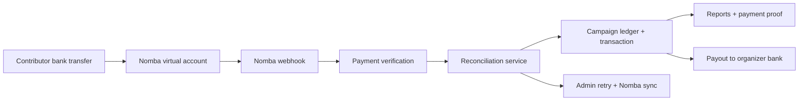

# ThriveFund Live Demo Guide

## Live Links

- App: https://thrivefund.live
- API: https://api.thrivefund.live/api/v1/health
- Public campaign format: `https://thrivefund.live/c/{campaign-slug}/`

## How To Test The Live App

1. Sign up as an organizer. ThriveFund creates the organizer profile and organization together.
2. Create a collection campaign. A Nomba virtual account should be generated for that campaign.
3. Open the public campaign page and confirm the account number, bank name, account name, and copy buttons are visible on mobile.
4. Send a small bank transfer to the campaign virtual account.
5. Watch the organizer dashboard update after the Nomba webhook is verified and reconciled.
6. Send another transfer from the same payer name. The contributor count should stay at one person, while total contributed sums both payments.
7. Download the campaign CSV/PDF report and a payment proof PDF from the payment activity table.
8. Complete or close the campaign. The public page should show that collection is closed instead of encouraging new transfers.
9. Request payout to a verified payout account. The campaign dashboard should show the timeline: Collected -> Settled -> Payout requested -> Paid out.
10. As an admin, open Webhook Health and Reconciliation to retry failed webhook processing or run a Nomba sync.

## Architecture

## Production Readiness Notes

- Health endpoint: `/api/v1/health`
- Admin recovery: `/admin/reconciliation` has Nomba sync history and a manual sync button.
- Webhook health: `/admin/webhooks` shows processed, failed, pending, and retryable webhook deliveries.
- Idempotency: duplicate provider references do not create duplicate transactions.
- Late payments: payments after completion are recorded for audit but do not over-credit the campaign ledger.
- Payout safety: a failed provider update cannot downgrade a payout that is already marked successful.
- Settlement fallback: the payout panel explains when funds are recorded but still settling before withdrawal.
- Public collection safety: completed or inactive campaigns hide payment instructions and show collection closed copy.

## Admin Troubleshooting

- Payment not showing: open `/admin/webhooks`, find the provider reference, and click Retry.
- Webhook missing but Nomba shows payment: open `/admin/reconciliation` and run Sync with Nomba.
- Payout unavailable: confirm the saved payout account is verified, then check whether settlement balance is still lagging.
- Duplicate payer: check campaign contributors; same normalized payer name should appear once, with total contribution summed from transactions.
- Export issue: use campaign CSV/PDF export and confirm payer names, amounts, provider references, and reconciliation status are present.

## Submission Assets To Capture

- Organizer dashboard with campaign stats.
- Public campaign page showing the Nomba virtual account and copy controls.
- Payment activity with successful transaction and payment proof PDF button.
- Campaign report export showing payer names.
- Payout timeline and settling fallback copy.
- Admin Webhook Health panel with retry action.
- Admin Reconciliation page with Sync with Nomba action.
