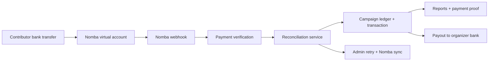

# ThriveFund Submission Overview

## Project Summary

ThriveFund is a live payment collection and reconciliation platform for Nigerian organizers. Each campaign receives a dedicated Nomba virtual account, incoming bank transfers are verified and matched automatically, and organizers get contributor tracking, reports, payment proof PDFs, and payout controls from one dashboard.

## Live Links

- App: https://thrivefund.live
- API health: https://api.thrivefund.live/api/v1/health
- Public campaign route: `https://thrivefund.live/c/{campaign-slug}/`

## Implemented Demo Flow

1. Organizer signup creates the organizer profile and linked organization in one flow.
2. Campaign creation provisions a dedicated Nomba virtual account for collection.
3. Public campaign pages show account details, progress, recent payment activity, and copy controls.
4. Nomba webhooks verify incoming transfers, match them to the campaign virtual account, and create successful transaction records.
5. Uninvited payers are auto-detected as contributors by campaign and normalized payer name.
6. Repeat payments from the same payer count as one contributor while summing total contribution from all successful transactions.
7. Campaign CSV/PDF exports include payer names, amounts, provider references, and reconciliation status.
8. Successful payment rows include downloadable payment proof PDFs.
9. Completed or inactive campaigns hide payment details on the public page and show collection closed messaging.
10. Payouts use verified bank accounts and show a timeline from collection through settlement and payout.
11. Admin tools expose webhook health, retry reconciliation, and Nomba sync recovery flows.

## Architecture

## Nomba Usage

- Dedicated virtual accounts for campaign collections.
- Webhook verification and idempotent payment reconciliation.
- Bank account lookup for verified payout destinations.
- Bank transfers from the configured Nomba sub-account to organizer payout accounts.
- Nomba sync tooling for recovery when webhook delivery or reconciliation requires a requery.

## Production Readiness

- Health endpoint: `/api/v1/health`
- Admin recovery: `/admin/reconciliation` shows Nomba sync history and manual sync controls.
- Webhook health: `/admin/webhooks` shows processed, failed, pending, and retryable webhook deliveries.
- Idempotency: duplicate provider references do not create duplicate transactions.
- Late payment handling: payments after completion are recorded for audit without over-crediting the campaign ledger.
- Payout safety: failed provider updates do not downgrade payouts already marked successful.
- Settlement UX: the payout panel uses neutral settled-balance language while funds are still settling.
- Public collection safety: completed or inactive campaigns hide account details and show closed messaging.

## Admin Operations

- Webhook retries are handled from `/admin/webhooks`.
- Reconciliation review and Nomba sync are handled from `/admin/reconciliation`.
- Payment and payout records are visible from the admin payments and payouts pages.
- Campaign reports and payment proof PDFs provide audit-ready documentation for organizers.

## Demo Screens Represented

- Organizer dashboard and campaign detail.
- Public campaign payment page.
- Payment activity with proof PDF download.
- Campaign CSV/PDF report export.
- Payout timeline and settled-balance messaging.
- Admin Webhook Health panel.
- Admin Reconciliation and Nomba Sync panel.
