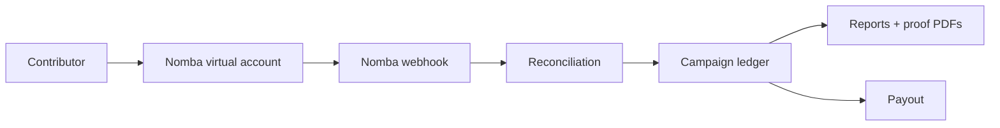

# ThriveFund

ThriveFund is a live payment collection and reconciliation platform for Nigerian organizers. It gives each campaign a dedicated Nomba virtual account, reconciles incoming bank transfers automatically, tracks contributors, produces audit-ready reports, and supports payout to verified organizer bank accounts.

## Live Project

- App: https://thrivefund.live
- API health: https://api.thrivefund.live/api/v1/health
- Submission overview: [DEMO.md](./DEMO.md)

## What It Does

- Organizer signup with automatic organization creation.
- Campaign collections with dedicated Nomba virtual accounts.
- Public campaign pages with account details, progress, and live payment activity.
- Nomba webhook verification, idempotent reconciliation, and transaction recording.
- Auto-detected contributors from successful uninvited payer names.
- Contributor rollups where repeat payments count once as a payer and sum total contribution.
- Campaign CSV/PDF exports and per-payment proof PDFs.
- Verified payout accounts and payout timeline: Collected -> Settled -> Payout requested -> Paid out.
- Admin recovery tools for webhook health, reconciliation retry, and Nomba sync.

## Nomba Integration

ThriveFund uses Nomba for:

- Dedicated virtual account collections.
- Payment webhook verification and reconciliation.
- Bank lookup for payout account verification.
- Bank transfers from the configured Nomba sub-account to organizer payout accounts.
- Admin sync/requery flows for production recovery.

## Architecture



## Project Structure

```text
ThriveFund/
├── backend/     # Node.js + Express + TypeScript modular monolith
├── frontend/    # Next.js 15 + TypeScript + Tailwind dashboard
├── docs/        # Architecture, API, webhook, and Nomba flow docs
└── DEMO.md      # Final submission overview
```

## Documentation

- [Submission Overview](./DEMO.md)
- [Architecture Overview](./docs/architecture-overview.md)
- [API Endpoints](./docs/api/endpoints.md)
- [API Quick Reference](./docs/api/quick-reference.md)
- [Webhook Specification](./docs/api/webhooks.md)
- [Nomba Withdrawal Flow](./docs/api/nomba-withdrawals.md)
- [Backend Modules](./docs/backend-modules.md)

## Local Development

Frontend:

```bash
cd frontend
npm install
npm run dev
```

Backend:

```bash
cd backend
npm install
cp .env.example .env
mysql ... < database/schema.sql
mysql ... < database/seed.sql
npm run dev
```

## Verification

The current implementation passes:

- Backend type-check: `npm run type-check`
- Backend tests: `npm test`
- Frontend production build: `npm run build`

## Tech Stack

- Next.js 15 and React 19
- Node.js, Express, and TypeScript
- MySQL
- Tailwind CSS
- Recharts
- Lucide React
